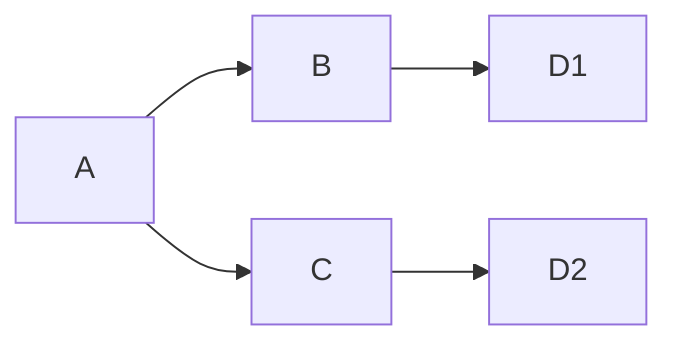
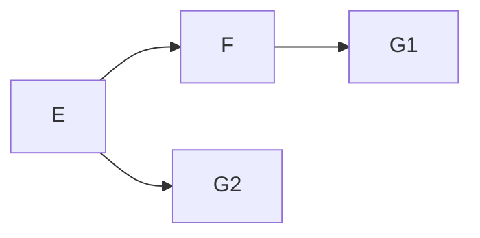
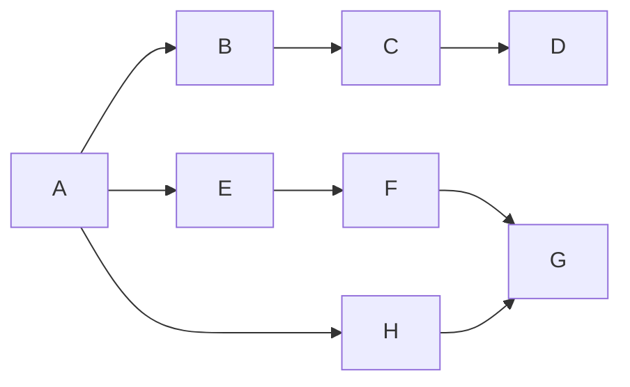
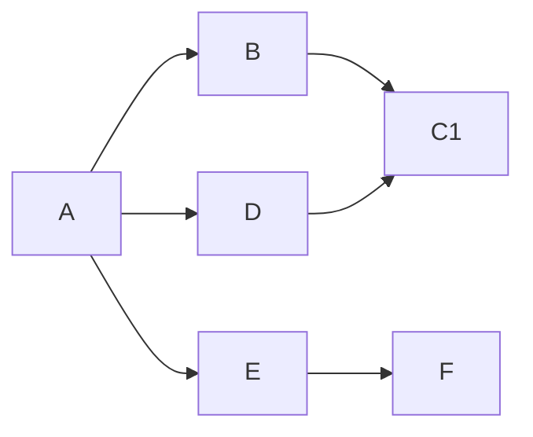
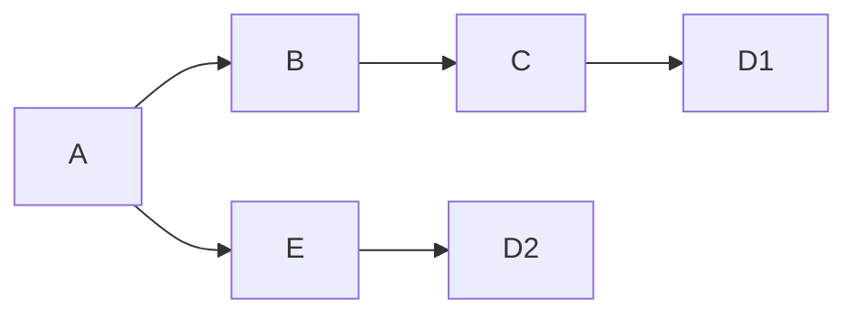
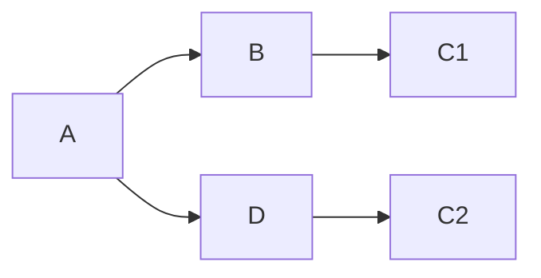
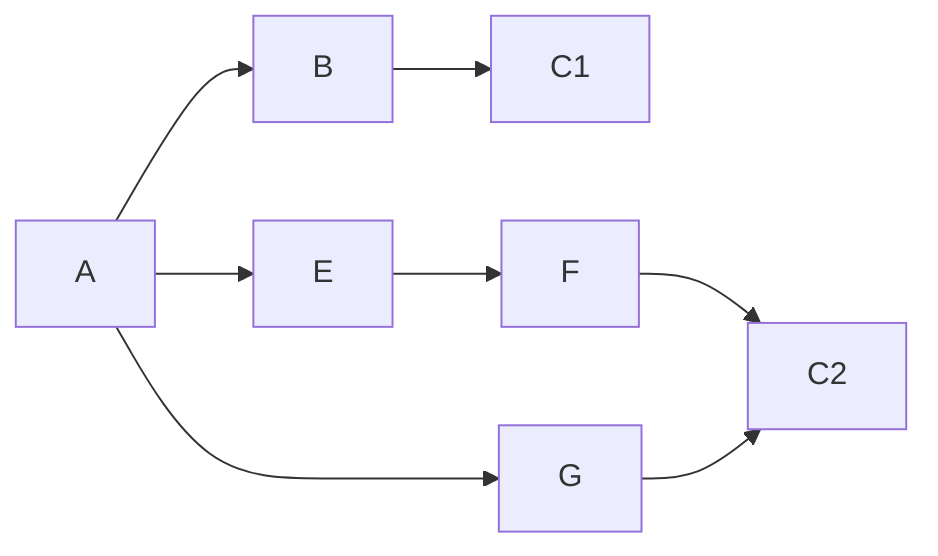

# Mais um pouco sobre Gerenciamento de dependências com npm

----

## Eis a questão

Como o npm gerencia uma dependência transitivas usadas em versões diferentes

Exemplo 1:



Exemplo 2:



----

## Tipos de dependência

- **Dependência Direta**
    Dependência diretamente usada pelo projeto declarada no package.json

- **Dependência Transitiva**
    Dependência das dependências declaradas no package-lock.json

No Exemplo 1

B e C são dependências diretas de A
D1 e D2 são dependências Transitivas de A

----

## O npm tentará achatar a árvore

Isso significa que as dependências transitivas ficarão na pasta `node_modules` do projeto na medida do possível

----

Exemplo sem conflito: **a arvore sera achatada completamente**



```log
node_modules
    \- A
    |- B
    |- C
    |- D
    |- E
    |- F
    |- G
    `- H
```

----

Exemplo dependência compatível: **a arvore sera achatada completamente**



```log
node_modules
    \- A
    |- B
    |- C1
    |- D
    |- E
    \- F
```

----

Exemplo com conflito: **a arvore será achatada em parte, as dependências mais próximas serão "elevadas" e as que deram conflito serão aninhadas dentro do respectivo pacote**



```log
node_modules
    \- A
    |- B
    |- C
    |  \- D1
    |- E
    \- D2
```

----

Exemplo com conflito no mesmo nível: **a arvore será achatada em parte, as dependências que vierem primeiro serão "elevadas" e as que deram conflito serão aninhadas dentro do respectivo pacote**



```log
node_modules
    \- A
    |- B
    |- C1
    |- D
        \- c2
```

----

Exemplo com múltiplos conflitos: **a arvore será achatada em parte, as dependências mais próximas serão "elevadas" e as que deram conflito serão aninhadas dentro do respectivo pacote mantendo uma cópia para cada pacote**



```log
node_modules
    \- A
    |- B
    |- C1
    |- E
    |- F
    |  \- C2
    \- G
       \- C2
```

## Um exemplo prático

```shell
➜ npm install massive
➜ npm ls
npm-dependencies-managment@1.0.0 /home/leofalco/LeoFalco/npm-dependencies-managment
├─┬ massive@6.4.0
│ ├── commander@5.1.0
│ ├─┬ glob@7.1.6
│ │ ├── fs.realpath@1.0.0
│ │ ├─┬ inflight@1.0.6
│ │ │ ├─┬ once@1.4.0
│ │ │ │ └── wrappy@1.0.2 deduped # dependencia compatível foi deduped
│ │ │ └── wrappy@1.0.2 deduped # dependencia compatível foi deduped
...

# mostrar node_modules que a arvore foi achatada

➜ npm install once@1.1

# mostrar no node_modules o conflito resolvido

```

## Bonus

atualmente quando o npm instala um pacote ele armazena em um cache local na maquina uma cópia dos pacotes baixados (para evitar baixa-los novamente)
assim o `npm install` ganha um aumento de performance quando o mesmo pacote for instalado novamente

npm cache verify

cd ~/.npm/_cacache # pasta onde o npm arquiva os caches

particularmente acho a abordagem do npm de manter uma pasta `node_modules`
dentro do projeto desnecessária, o node poderia ter uma pasta global com as instalações dos pacotes ao invés de gerenciar um `node_modules` por projeto duplicando diversos pacotes corriqueiros  que aparecem em diversos projetos (libs de teste, conexão com banco de dados, etc)
